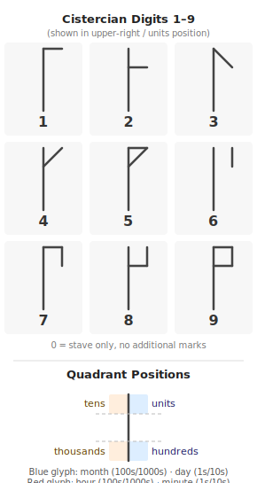

# cistercian-clock

Android home-screen widget that displays the current **date and time** as a pair of [Cistercian numeral](https://en.wikipedia.org/wiki/Cistercian_numerals) glyphs. Updates every minute via `AlarmManager`.

Built with Jetpack Glance (Compose-based widget API), targeting Android 8+ (API 26), optimised for Pixel / Android 16 (API 36).

---

## Reading the widget

Two glyphs are shown side by side:

| Glyph | Color | Thousands / Hundreds | Tens / Units |
|-------|-------|----------------------|--------------|
| Left  | Blue  | Month of year        | Day of month |
| Right | Red   | Hour (24h)           | Minute       |

e.g. **14 June at 09:37** → blue glyph = `0614`, red glyph = `0937`

### How Cistercian numerals work

Each glyph is a single vertical stave divided into four quadrants. One digit (0–9) is encoded in each quadrant by the pattern of strokes attached to the stave:



The quadrant positions:

```
  tens  |  units
        |          ← stave
thousands | hundreds
```

Digit 0 is represented by the absence of marks (stave only). Combining all four quadrants produces a single glyph that encodes any number from 0–9999.

---

## How it works

### Date glyph (blue)

| Quadrant    | Position     | Value |
|-------------|--------------|-------|
| Upper-left  | Tens         | month / 10 |
| Upper-right | Units        | month % 10 |
| Lower-left  | Thousands    | day / 10   |
| Lower-right | Hundreds     | day % 10   |

### Time glyph (red)

| Quadrant    | Position     | Value |
|-------------|--------------|-------|
| Upper-left  | Tens         | hour / 10  |
| Upper-right | Units        | hour % 10  |
| Lower-left  | Thousands    | minute / 10 |
| Lower-right | Hundreds     | minute % 10 |

e.g. 09:37 → units=9, tens=0, hundreds=7, thousands=3

---

## Prerequisites

- Android Studio Ladybug (2024.2) or newer
- Android SDK 26+ (API 36 recommended; install via SDK Manager)
- A physical device or emulator running Android 8.0+

## Build & install

1. Open the `cistercian-clock/` folder in Android Studio.
2. Let Gradle sync.
3. Run on a device/emulator: **Run ▶ app**.
4. Long-press the home screen → **Widgets** → **Cistercian Clock**.

The widget defaults to **1×1** and is resizable in both directions (drag handles appear on long-press).

> **Note:** If building from the terminal, the system JDK must be version 17 or 21. On macOS with Android Studio installed:
> ```bash
> JAVA_HOME="/Applications/Android Studio.app/Contents/jbr/Contents/Home" ./gradlew assembleDebug
> ```

## Project layout

```
app/src/main/java/com/cistercian/clock/
  Cistercian.kt              — stroke table, quadrant transforms, decomposeTime/decomposeDate
  CistercianClockWidget.kt   — Glance composable + combined bitmap renderer (renderBothGlyphs)
  CistercianClockReceiver.kt — GlanceAppWidgetReceiver + AlarmManager scheduling
app/src/main/res/
  xml/cistercian_clock_widget_info.xml — widget metadata (1×1 default, resizable)
  values/strings.xml
docs/
  cistercian-reference.svg   — digit and quadrant reference diagram
```

---

## Attributions

**Cistercian numeral system**
The medieval Cistercian numeral system was devised by Cistercian monks in the early 13th century. For a thorough history and glyph survey see:
- David A. King, *The Ciphers of the Monks* (Franz Steiner Verlag, 2001)
- Wikipedia: [Cistercian numerals](https://en.wikipedia.org/wiki/Cistercian_numerals)

**Glyph geometry reference**
Stroke proportions and quadrant layout are derived from the **FRBCistercian** open-source font project by Fredrick R. Brennan:
- Repository: <https://github.com/ctrlcctrlv/FRBCistercian>
- License: The FRBCistercian font is released under the [SIL Open Font License 1.1](https://scripts.sil.org/OFL).

The glyph-drawing code in `Cistercian.kt` and `CistercianClockWidget.kt` is an independent implementation in Kotlin/Android Canvas; no font files or compiled assets from FRBCistercian are bundled in this app.

**Unicode proposal**
The Unicode encoding proposal for Cistercian numerals (L2/20-290) by Kirk Miller provided additional reference material for the stroke table.

**Libraries**
- [Jetpack Glance](https://developer.android.com/jetpack/androidx/releases/glance) — Apache 2.0
- [AndroidX Core KTX](https://developer.android.com/kotlin/ktx) — Apache 2.0
- [Jetpack Compose](https://developer.android.com/jetpack/compose) — Apache 2.0
